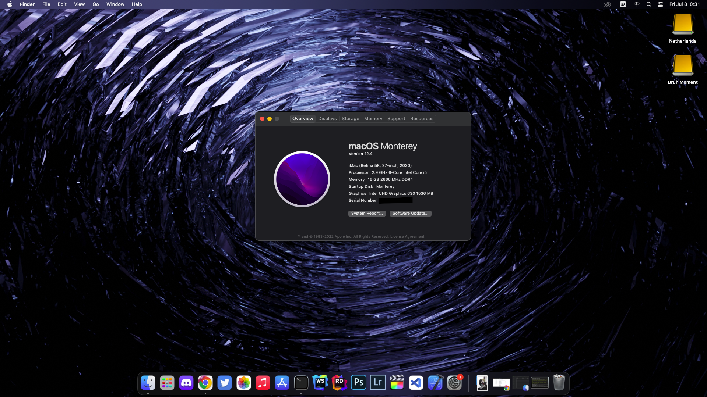

# EX-H410M-V3 + Intel i5 10400 (iGPU) OpenCore Configuration

Baseline config for EX-H410M-V3 and Intel i5 10400 Hackintosh

## System Information

| Part        |                                                     |
|-------------|-----------------------------------------------------|
| Motherboard | Asus EX-H410M-V3                                    |
| CPU         | Intel i5 10400                                      |
| GPU         | Intel UHD Graphics 630                              |
| Ethernet    | Realtek RTL8168/8111 PCI-E Gigabit Ethernet Adapter |
| Chipset     | H410                                                |

## Tested OS

| macOS Version             | Status |
|---------------------------|--------|
| macOS 12.4                | ✅     |
| macOS 12.5                | ✅     |
| macOS 12.5.1              | ✅     |
| macOS 12.6                | ✅     |
| macOS 12.6.X              | ✅     |
| macOS 13                  | ✅     |
| macOS 13.0.1              | ✅     |
| macOS 13.1                | ✅     |
| macOS 13.2                | ✅     |
| macOS 13.2.1              | ✅     |
| macOS 13.3                | ✅     |
| macOS 13.3.1              | ✅     |
| macOS 13.3.1 (a)          | ✅     |
| macOS 13.4                | ✅     |
| macOS 13.4.1              | ✅     |
| macOS 14 Developer Beta 1 | ✅     |
| Others                    | N/A    |

## Next Steps

In this configuration, You have to use [GenSMBIOS](https://github.com/corpnewt/GenSMBIOS) to generate your own SMBIOS. I recommend using `iMac20,1`.

ACPIs here came from the OpenCore docs. I have compiled my own ACPIs and if you also wish to do so, this [guide](https://dortania.github.io/Getting-Started-With-ACPI/) will help you out. It's easy.

This uses `USBInjectAll.kext` for the USB connectivity. It is recommended to map your own USB ports using this [tool](https://github.com/USBToolBox/tool). It requres [`USBToolbox.kext`](https://github.com/USBToolBox/kext) to be loaded first. More information about this can be found on the links in this paragraph. This explains why you should do [this](https://dortania.github.io/OpenCore-Install-Guide/config.plist/comet-lake.html#quirks-3) (Applies only on macOS 11.3+).

If you are using iGPU, just skip this. Otherwise, you should configure `config.plist` with respect to your current GPU. To do so, consult the OpenCore docs for what you should do.

If you are into using FileVault/Apple Secure Boot, see [this](https://dortania.github.io/OpenCore-Post-Install/universal/security.html).

**Remember, if you made changes to ACPIs or kexts, reload them in the config first!**

If you are ready, then might as well test it!

## Troubleshooting

Consult the OpenCore docs. I will not be entertaining problems.

## Updates

This repository will be updated regularly every new macOS Versions. If there are no updates, then this EFI works on that version. Though, I may get tired of updating this in the near future so might as well try to fix issues on your own.
